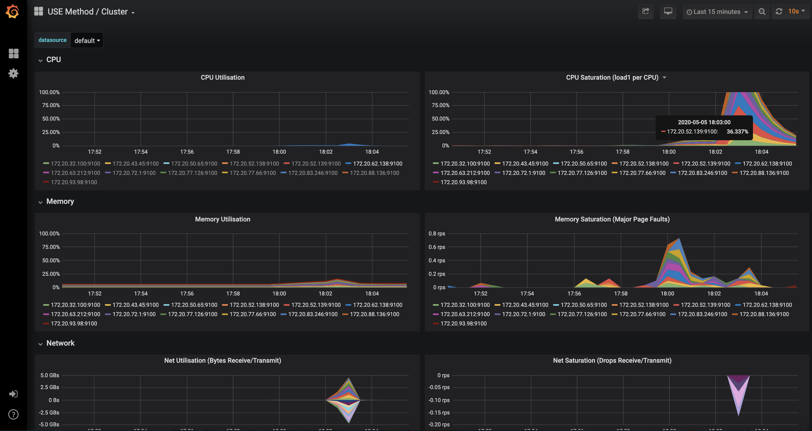

# Monitoring and Observability

## Infrastructure monitoring

In order to understand what your Kubernetes cluster is doing, you can use Grafana and check the dashboards.

### Access Grafana

Port forward the Grafana service to a local port. Then access Grafana on [http://localhost:3000](http://localhost:3000)

Default admin credentials are `username: admin` ; `password: admin`

```text
$ kubectl port-forward service/prometheus-operator-grafana 3000:80
```

### Dashboards

By default the Testground infrastructure playbooks auto-provision a set of dashboards that provide visibility into the Testground infrastructure:


As Testground matures, these dashboards are likely to change.

### Cluster-wide resources utilisation

You can view aggregated resources usage on the whole Cluster with the `USE Method / Cluster` dashboard.



### Worker node resources utilisation

You can view CPU, memory, network, disk utilisation per node at the `USE Method / Node`edashboard.


## Application / Test run monitoring

In order to understand what your `test run` is doing, you can use Grafana and view some of the metrics emitted by it to InfluxDB, while it is running, such as the:

* Life-cycle events
* Diagnostics \(i.e. go runtime metrics\)


## Redis monitoring

Redis is an integral part of the `sync service` used to provide synchronisation and coordination between test plan instances. You can check it's utilisation on the `Redis` dashboard.


## WeaveNet monitoring

WeaveNet is used for the `data` plane in Testground - all test plan instances communicate with each other over WeaveNet. You can check statistics from the usage of the network at the `WeaveNet` dashboards.


### 

