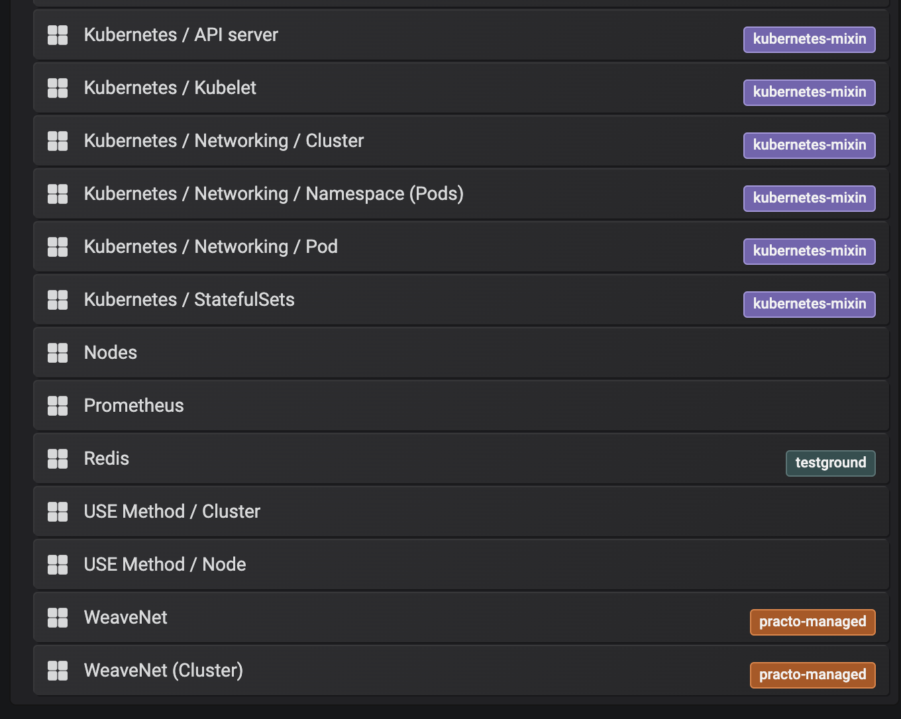

# Monitoring and Observability

## Access Grafana

Port forward the Grafana service to a local port. Then access Grafana on [http://localhost:3000](http://localhost:3000)

Default admin credentials are `username: admin` ; `password: admin`

```text
$ kubectl port-forward service/prometheus-operator-grafana 3000:80
```

By default the Testground infrastructure playbooks auto-provision a set of dashboards that provide visibility into the Testground infrastructure as well as into Testground test runs.

## Infrastructure monitoring

In order to understand what your Kubernetes cluster is doing, you can use Grafana and view some of the charts.

### Default dashboards



As Testground matures, these dashboards are likely to change.

### Worker node resources utilisation

You can review CPU, memory, network and disk resource utilisation per node:


## Application / Test run monitoring

In order to understand what your `test run` is doing, you can use Grafana and view some of the metrics emitted by it to InfluxDB, while it is running, such as the:

* Life-cycle events
* Diagnostics \(i.e. go runtime metrics\)


You can create your own dashboards, tailored to your test plan and visualise stats as they are emitted from your test plan instances.

### 

